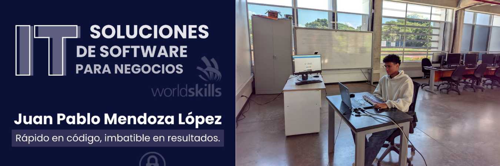

# Worldskills Preselección 2025 **– 🥇 Oro Nacional en Desarrollo de Software**



Este repositorio recopila el trabajo realizado durante mi **participación en la preselección nacional de WorldSkills Colombia 2025**, en la **habilidad 09 – Desarrollo de Software**, donde alcancé **el primer lugar a nivel nacional** entre los **cinco mejores competidores regionales del país**, de un total de **22 participantes**, representando con orgullo a la **Regional Guajira**.

Nunca había participado en un encuentro de esta magnitud, lo que me exigió un gran esfuerzo y la demostración de mis habilidades.

Gracias a mi excelente participación, clasifiqué a la **Competencia Nacional WorldSkills Colombia 2025**, donde pude demostrar una vez más mi disciplina y habilidades a escala nacional, con la visión de proyectarme hacia nuevas fronteras

<div align="center">


</div>

## 📚 Tabla de Contenidos

-   [📁 Estructura del Repositorio](#-estructura-del-repositorio)
-   [🎯 Descripcion de la Competencia](#-descripcion-de-la-competencia)
-   [📬 Contacto](#-contacto)

---

## 📁 Estructura del Repositorio

```bash
worldskills-preseleccion-2025/
├── docs/                       # Documentacion e información de la competencia
├── prueba                      # Prueba
└── README.md                   # Documentación principal del repositorio
```

---
## 🎯 Descripcion de la Competencia

La prueba se realizó de forma **virtual**, con una duración total de **tres horas**, durante las cuales se desarrollaron los dos módulos.

Para la supervisión, se utilizaron **dos cámaras simultáneas** enfocadas en mi entorno y pantalla, con el fin de asegurar la **transparencia y validez de la evaluación**.

Cada módulo exigía aplicar conocimientos técnicos de manera autónoma, gestionando correctamente el tiempo y demostrando **capacidad de resolución y dominio de las tecnologías utilizadas**.

### Prueba - Desarrollo de un sistema para la administración de un restaurante

Esta prueba consistió en **recrear un sistema de inventario** para un restaurante, evaluando la capacidad para construir un sistema logico y bien construido.

[Ver detalles de la prueba](./prueba/README.md)

---

## 📬 Contacto

Para preguntas, soporte o colaboración, por favor contacta:

-   Juan Pablo Mendoza Lopez
-   Correo: [mendozalopez.py@gmail.com](mailto:mendozalopez.py@gmail.com)
-   LinkedIn: [Juan Pablo Mendoza Lopez](https://www.linkedin.com/in/juan-pablo-mendoza-lopez/)
-   GitHub: [@JuanPabloMendozaLopez](https://github.com/JuanPabloMendozaLopez)


