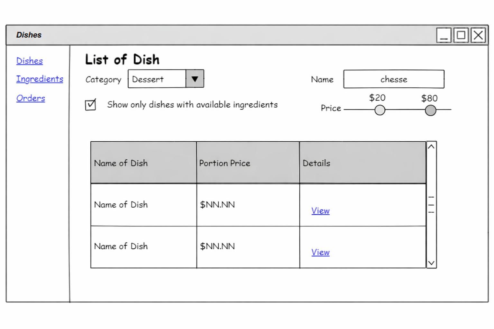
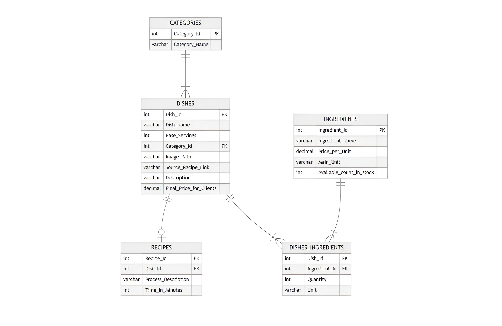

# 🖥️ Prueba - Desarrollo de un sistema para la administración de un restaurante

[🔙 Volver al inicio](../README.md#-descripcion-de-la-competencia)

[📄 Ver prueba](./docs/WSPRE2025_TP09.pdf)

Este proyecto consiste en el diseño e implementación de una base de datos relacional, junto con el desarrollo de una aplicación de escritorio para la gestión de platos, ingredientes y recetas.

La solución permite visualizar, filtrar y administrar la información de forma dinámica, simulando un sistema real de gestión para un restaurante.

# Observaciones

Durante la prueba logré completar el proyecto en su totalidad conforme a las indicaciones establecidas.

Este resultado me permitió destacar entre los demás competidores, evidenciando un buen manejo del tiempo y capacidad de adaptación bajo presión.

## Instalación

1. Extrae la carpeta del proyecto con el nombre `/GastroManager` en la carpeta `/solution`.
2. Importa el archivo `DishManagmnentDB_Script.sql` para crear la base de datos.
3. Abre el proyecto en tu IDE preferido (por ejemplo, Visual Studio).
4. Restaura los paquetes y dependencias necesarios.
5. Ejecuta la aplicación.
